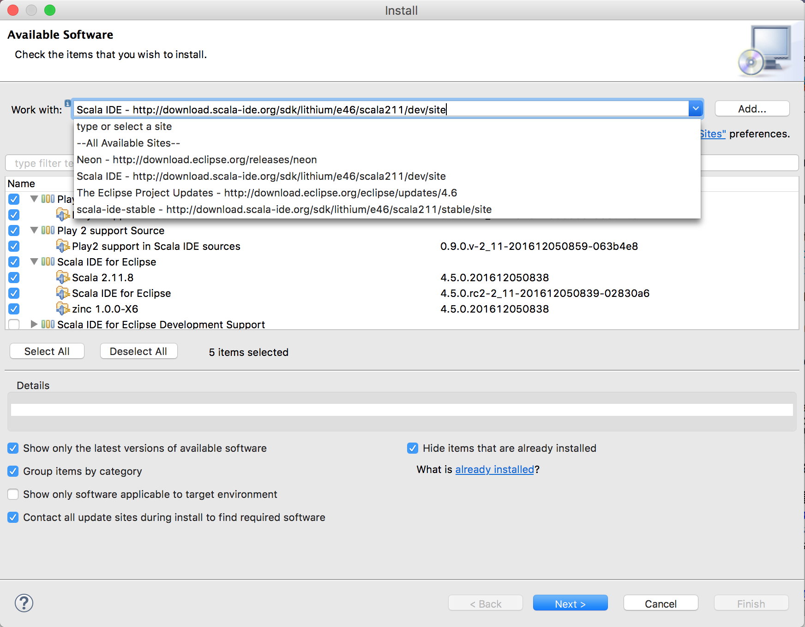

# PlayFramework 설치  
## 0.설치 전 필요사항
Scala IDE, JDK는 모두 설치되어 있다는 가정하에 정리해보려 한다.
현재 설치된 JDK : 1.8.x
Scala IDE : Neon

## 1. sbt 다운로드
http://www.scala-sbt.org/ 에서 sbt를 다운받아 설치한다.  
맥을 사용하는 경우 brew를 통해서 간편하게 설치할 수 있다.  
```bash
$ brew install sbt
```
만약 윈도우,리눅스 사용자라면 다운로드받은 디렉터리를 환경변수에 추가해줘야 os전역에서 sbt명령어를 사용할 수 있다.  

## 2. Starter Project 다운로드, sbt 빌드
https://www.playframework.com/download#starters 에서 다운로드 가능하다. zip파일로 다운받아서 압축을 푼후 해당 디렉터리로 콘솔 명령프롬프트나, 터미널로 진입한다. 

```bash
$ sbt run
(이미 sbt를 전역으로 설치해놓은 상태이므로 ./sbt와 같은 형식으로 빌드하지 않아도 된다.)

…
…
[info] Resolving org.eclipse.jetty.websocket#websocket-common;9.2.15.v20160210 .[info] Resolving jline#jline;2.12.1   ...  
[info] Done updating.  
  
--- (Running the application, auto-reloading is enabled) ---  
  
[info] p.c.s.NettyServer - Listening for HTTP on /0:0:0:0:0:0:0:0:9000  

(Server started, use Ctrl+D to stop and go back to the console…)  
```

이후 127.0.0.1:9000 에 방문해보면 아래와 같은 화면이 나타난다.  


## 3. Play Seed 템플릿 생성
scala기반의 프로젝트를 생성하려면
```bash
$ sbt new playframework/play-scala-seed.g8
```
java기반의 프로젝트를 생성하려면
```bash
$ sbt new playframework/play-java-seed.g8
```
…  
…  
이제 명령모드로 진입하게 되고 project의 name, package명, 버전 등을 적어달라는 메시지가 나온다.
```bash
name [play-scala-seed]: orange
organization [com.example]: org.test
scala_version [2.11.8]: 그냥 엔터
scalatestplusplay_version [2.0.0]: 그냥 엔터
play_version [2.5.13]: 그냥 엔터

Template applied in ./orange
```
와 같은 메시지를 확인 했다면 성공적으로 템플릿생성이 완료된 것이다.  
이제 생성된 orange디렉터리에 진입해서 build.sbt의 내용을 확인해보면 아래와 같다.  
```bash
$cd orange
$vim build.sbt

name := """orange"""
organization := "org.test"

version := "1.0-SNAPSHOT"

lazy val root = (project in file(".")).enablePlugins(PlayScala)

scalaVersion := "2.11.8"

libraryDependencies += filters
libraryDependencies += "org.scalatestplus.play" %% "scalatestplus-play" % "2.0.0" % Test

// Adds additional packages into Twirl
//TwirlKeys.templateImports += "org.test.controllers._"

// Adds additional packages into conf/routes
// play.sbt.routes.RoutesKeys.routesImport += "org.test.binders._"
```
콘솔에서 입력한 내용들이 build.sbt에 그대로 기록되는 것임을 알수 있다.     build.sbt는 빌드환경설정에 중요한 파일임을 알수 있따.  

## 4. sbt로 생성한 프로젝트를 Scala IDE에서 import할 수 있도록 설정
sbt로 생성한 orange라는 프로젝트를 Scala IDE에서 열기위해서는 project 디렉터리의 환경설정 파일에 별도로 정보를 기입해줘야 한다.  
  

( $ sbt eclipse라는 명령어를 찾지 못해 시간이 조금 걸렸다. official page에서는 eclipsify또는 sbteclipse를 치라고 설명되어 있다. 하지만, 2017년 3월 현재, 최신버전은 sbteclipse를 이용해야하고 링크를 타고 건너건너가면서 documentation을 참고할때 어느곳에도 $ sbt eclipse를 입력하라는 설명은 없었다. 결국 playframework scala ide라는 검색어로 최근 1년동안의 자료로 검색해본 결과 [여기](http://alvinalexander.com/scala/sbt-how-to-configure-work-with-eclipse-projects)서 명령어를 찾아냈다. ㅋㅋ 그 외에 sbteclipse 플러그인을 설치하는 방법은 공식홈페이지의 내용을 따르면 된다.)

orange디렉터리 내의 project로 들어가보자.  
```bash
$ cd project
$ vim plugins.sbt
…
…
가장 마지막줄이나 적당한 곳에  
addSbtPlugin("com.typesafe.sbteclipse" % "sbteclipse-plugin" % "4.0.0”)
를 입력하고 저장한다.
```

이제 터미널 또는 프롬프트에서 sbt eclipse를 입력해보자  
```bash
$sbt eclipse
…
…
[info] downloading https://repo1.maven.org/maven2/io/netty/netty/3.5.7.Final/netty-3.5.7.Final.jar ...
[info]      [SUCCESSFUL ] io.netty#netty;3.5.7.Final!netty.jar(bundle) (807ms)
[info] Done updating.
[info] Successfully created Eclipse project files for project(s):
[info] orange
```
와 같은 화면이 나타난다면 성공적으로 설정된 것이다.  
## 5. Scala IDE 환경설정 
[http://scala-ide.org/docs/user/gettingstarted.html](http://scala-ide.org/docs/user/gettingstarted.html)
구글에서 scala-ide sbt를 검색하면 제일 맨 위에 나오는 페이지다. 망설임 없이 클릭해 들어가서 찬찬히 주욱 읽어보니  
- help>install new software> add > url입력
- Scala version 선택
- Scala IDE for Eclipse의 하위 항목들을 펼쳐서 플러그인을 선택
그후 설치를 시작하라고 한다.  

메뉴얼에 따라 설치를 진행해보면,  
아래화살표 선택해 Scala IDE항목 (update site, scala-ide설치시 기본으로 나열된 item이고, 홈페이지에는 Scala IDE라고 이름지어진 site를 선택하는게 obvious choice라는군… 오랜만에 영어써본다…ㅋㅋ  

홈피에서 설명하는데로 선택해봤다. Scala 2.10버전을 선택하면 스칼라 버전을 2.10을 사용하는 프로젝트에 대한 지원을 한다는 받아쓰기 한듯한 설명을 보고나서 터미널에 아래의 내용을 타이핑 해보니  
```bash
$ sbt
$ scala-version
```
어제 sbt툴을 설치하면서 설치된 scala의 버전은 2.11.8이다. 따라서 아래 화면에서 Scala 2.11.8을 선택해도 된다. 그리고 홈피에서 Scala IDE for Eclipse를 선택하라고 해서 선택했다.  

그 다음 서브항목은 설명이 따로 없으나 그냥 선택했다. ㅎㅎ 모두 선택했으면 Next  

이후 Next, Next를 계속 눌러서 import한다.  

## 6. Scala IDE에서 play project 임포트

